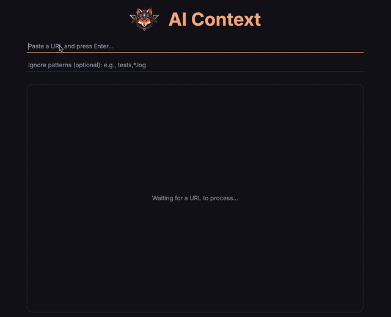
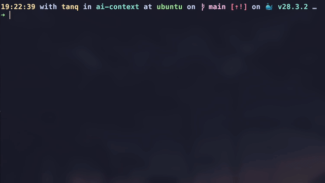
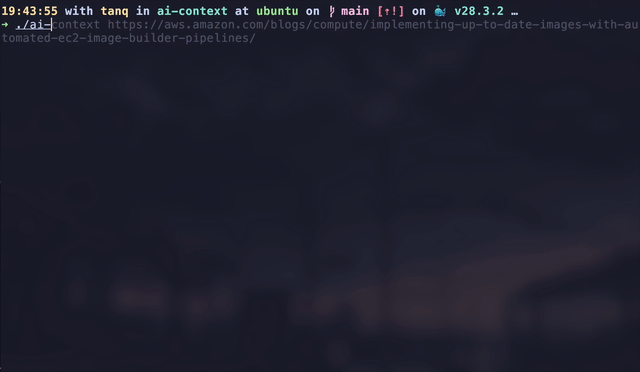

<div align="center">


<h1>AI Context</h1>

[](https://github.com/tanq16/ai-context/actions/workflows/build-release.yml)
[](https://github.com/Tanq16/ai-context/releases/latest)

Generate AI-friendly markdown files from GitHub repos, local code, YouTube videos, or webpages using a multi-arch, multi-OS CLI tool to make your interactions with LLMs (like ChatGPT, Claude, etc.) easy. AI Context can also serve a web frontend for self-hosting.

<a href="#features">Features</a> &bull; <a href="#installation">Installation</a> &bull; <a href="#usage">Usage</a> &bull; <a href="#acknowledgments">Acknowledgements</a>

</div>

---

`Quickstart` &rarr;

```bash
ai-context "https://github.com/tanq16/ai-context" # single URL
ai-context -f urllist.file                        # URL file
ai-context serve                                  # serve with web frontend
```

For self-hosting the web frontend as a Docker container, use:

```bash
docker run --rm --name "ai-context" -d tanq16/ai-context:main
```

## Features

- **Local Directory Processing**
    - this is mainly for locally available code bases (directories or already cloned git repos)
    - the context file includes directory structure and all file contents within context
- **GitHub Repository Processing**
    - this clones and processes provided GitHub link and does the same as *Local Directory Processing*
    - it temporarily clones the repository, so no need for cleanup
    - it also supports private repositories on GitHub through use of `GH_TOKEN` environment variable
- **YouTube Transcript Processing**
    - this downloads transcripts for given YouTube video link and stores it as markdown
    - the transcript also preserves time segments
- **WebPage Processing**
    - this converts an HTML webpage to markdown text, stripping off JS and CSS
    - it also downloads all images from the page and stores them locally with UUID filenames
    - the markdown text includes links via local paths to the downloaded images
- **Self-Hosted Application Variant**
    - you can self-host the application for quick access from devices with browsers to get context
    - web frontend uses a simple but elegant Tailwind-UI to allow copy/download of context from all sources

## Installation

- **Binary**
    - Download the latest release for your platform and OS from the [releases page](https://github.com/tanq16/ai-context/releases)
    - Binaries are build via GitHub actions for MacOS, Linux, and Windows for both AMD64 (x86_64) and ARM64 (like Apple Silicon) architectures
    - You can also download specific versions if needed; however, the latest version is recommended
- **Go Install**
    - Run the following command (requires `Go v1.22+`):
    ```bash
    go install github.com/tanq16/ai-context@latest
    ```
    - For specific versions, use binaries or build specific commits as I have not and will not implement Go-native binary versioning
- **Local Build**
    ```bash
    git clone https://github.com/tanq16/ai-context.git && \
    cd ai-context
    ```
    ```bash
    go build .
    ```

## Usage

### Screencasts

| | |
| --- | --- |
| UI |   |
| CLI |   |

### Primary Usage

```bash
# Process a single path (local directory) with additional ignore patterns
ai-context /path/to/directory  -i "tests,docs,*doc.*"

# Process one URL (GitHub repo or YouTube Video or Webpage URL)
ai-context https://www.youtube.com/watch?v=video_id

# Make a list of paths
cat << EOF > listfile
../notif
/working/cybernest
https://github.com/assetnote/h2csmuggler
https://docs.aws.amazon.com/IAM/latest/UserGuide/id_roles.html
EOF

# Process URL list concurrently
ai-context -f listfile

# Process private GitHub repository
GH_TOKEN=$(cat /secrets/GH.PAT) ai-context -u https://github.com/ORG/REPO
```

> [!WARNING]
> For directory path (in URL or listfile mode), the path should either start with `/` (absolute) or with `./` or `../` (relative). For current directory, always use `./` for correct regex matching.

### Output

- The tool creates a local folder called `context` and puts everything converted into `.md` files in that folder
- The filenames have the syntax of `TYPE-PATHNAME.md` (example, `gh-ffuf_ffuf.md`)
- Every single path in the `listfile` mode will result in a new context file
- All images (only downloaded via webpages) are named as UUIDs and stored in the `context/images` directory (images are downloaded as a conenience, but doesn't take away from text-first context creation)

### Command Line Options

- CLI argument: provide a path (GitHub repo, YouTube video, WebPage link, or relative/absolute directory path) to process
- `-f, --file`: provide a file with a list of paths (URLs or directory paths) to process
- `-i, --ignore`: add additional patterns to ignore during processing (comma-separated)
- `-t, --threads`: (*optional*) number of workers for concurrent file processing when passing list file (default = 10)

> [!TIP]
> - Do a `head -n 200 context/FILE.md` (or 500 lines) to view the content tree of the processed code base or directory to see what's been included. Then refine your `-i` flag arguments to ignore additional patterns.
> - When processing a large number of items, it can look stalled due to thread limits and image download times; use `--debug` to enable verbose logs to know what's running.

### Default Ignores

The tool includes pre-defined and sensible ignore patterns, including common files and directories that typically don't add value to the context. These are:

- Version control files (.git, .gitignore)
- Dependencies (node_modules, vendor)
- Compiled files (*.exe, *.dll)
- Media files (images, videos, audio)
- Lock files (package-lock.json, yarn.lock)
- Build artifacts and caches

For a full list, see `aicontext/ignores.go`.

## Acknowledgments

This project takes inspiration from, uses, or references:

- [repomix](https://github.com/yamadashy/repomix): inspiration for turning code into context
- [innertube](https://github.com/tombulled/innertube): inspiration for code to get transcript from YouTube video
- [html-to-markdown](https://github.com/JohannesKaufmann/html-to-markdown/v2): used to convert HTML to MD
- [go-git](https://github.com/go-git/go-git/tree/main): git operations in Go
