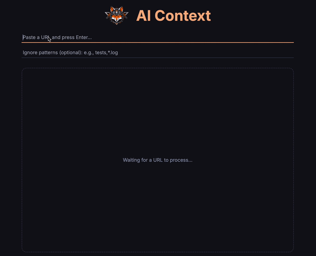
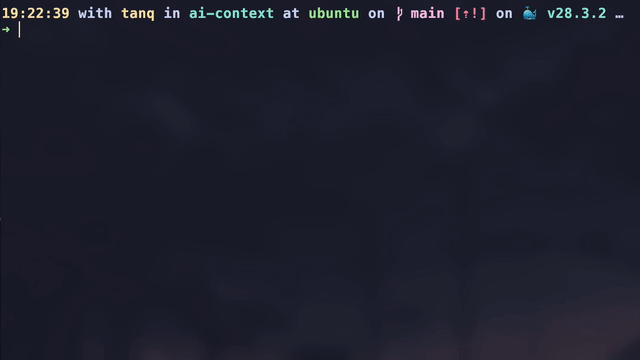
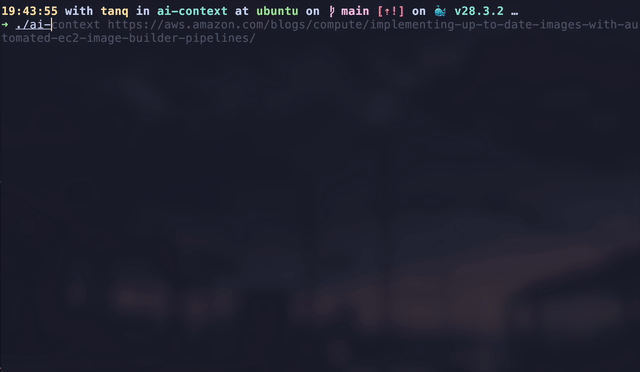

<div align="center">
  
  <h1>AI Context</h1>

  <a href="https://github.com/tanq16/ai-context/actions/workflows/release.yaml"></a>&nbsp;<a href="https://hub.docker.com/r/tanq16/ai-context"></a><br>
  <a href="https://github.com/tanq16/ai-context/releases"></a><br><br>
  <a href="#features">Features</a> &bull; <a href="#installation">Installation</a> &bull; <a href="#usage">Usage</a> &bull; <a href="#acknowledgments">Acknowledgements</a>
</div>

---

Generate AI-friendly markdown files from GitHub repos, local code, YouTube videos, or webpages using a multi-arch, multi-OS CLI tool to make your interactions with LLMs (like ChatGPT, Claude, etc.) easy. AI Context can also serve a web frontend for self-hosting.

## Features

- **Local Directory Processing**: Context includes directory structure and file contents.
- **GitHub Repository Processing**: Clones temporarily and processes provided GitHub link (supports private repositories via `GH_TOKEN`).
- **YouTube Transcript Processing**: Downloads transcripts and preserves time segments.
- **WebPage Processing**: Converts HTML to markdown, strips JS/CSS, and downloads images locally.
- **Self-Hosted Application Variant**: Self-host the web frontend for quick access from devices with browsers.

## Screenshots

<details>
<summary>Click to expand screenshots</summary>

| UI | CLI |
| --- | --- |
|   |   |

</details>

## Installation and Usage

### Docker (Recommended)

```bash
docker run --rm --name "ai-context" -p 8080:8080 -d tanq16/ai-context
```

### Binary

Download from [releases](https://github.com/tanq16/ai-context/releases) and run:

```bash
./ai-context serve --port 8080
```

### Build from Source

```bash
git clone https://github.com/tanq16/ai-context.git
cd ai-context
make build
./ai-context serve
```

### CLI Usage

```bash
# Process a single path (local directory) with additional ignore patterns
./ai-context /path/to/directory  -i "tests,docs,*doc.*"

# Process one URL (GitHub repo or YouTube Video or Webpage URL)
./ai-context https://www.youtube.com/watch?v=video_id

# Process URL list concurrently
./ai-context -f listfile

# Process private GitHub repository
GH_TOKEN=$(cat /secrets/GH.PAT) ./ai-context https://github.com/ORG/REPO
```

## Tips and Notes

- For directory path (in URL or listfile mode), the path should either start with `/` (absolute) or with `./` or `../` (relative). For current directory, always use `./` for correct regex matching.
- Do a `head -n 200 context/FILE.md` (or 500 lines) to view the content tree of the processed code base or directory to see what's been included. Then refine your `-i` flag arguments to ignore additional patterns.

## Acknowledgments

This project takes inspiration from, uses, or references:

- [repomix](https://github.com/yamadashy/repomix): inspiration for turning code into context
- [innertube](https://github.com/tombulled/innertube): inspiration for code to get transcript from YouTube video
- [html-to-markdown](https://github.com/JohannesKaufmann/html-to-markdown/v2): used to convert HTML to MD
- [go-git](https://github.com/go-git/go-git/tree/main): git operations in Go
